# Iterative HW–SW Co-Design — Layout Re-Optimization (ICD)

## System Overview & Architecture Analysis

This repository implements a production-grade, scientifically rigorous pipeline for **iterative hardware-software co-design** through memory layout re-optimization. The system orchestrates a complex workflow: `permute → transform(S/Q/K) → re-permute → measure → accept/rollback`, with emphasis on determinism, comprehensive observability, and CI/CD portability.

### Core Research Hypothesis
The ICD system tests the hypothesis that **iterative re-permutation after tensor transformations** (sparsity, quantization, KV caching) can significantly improve memory locality and system performance compared to static layout optimization alone.

### System Architecture Pyramid

```
                    ┌─────────────────────────────┐
                    │     CLI & Orchestration     │ ← User Interface & Pipeline Control
                    │    (icd.cli, orchestrator)  │
                    └─────────────────────────────┘
                               │
                    ┌─────────────────────────────┐
                    │    Configuration System     │ ← Multi-format Config Management
                    │  (JSON/YAML, Schemas, Gates) │
                    └─────────────────────────────┘
                               │
        ┌─────────────────┬────┴────┬─────────────────┐
        │                 │         │                 │
   ┌────▼────┐    ┌──────▼──────┐  ┌▼──────────┐   ┌─▼─────────┐
   │  Core   │    │   Runtime   │  │ Adapters  │   │  Measure  │
   │ Engine  │    │    Logic    │  │Transform  │   │& Quality  │
   │         │    │             │  │           │   │ Assessment│
   │• Graph  │    │• Runners    │  │• Sparsity │   │• Latency  │
   │• Solver │    │• Compare    │  │• Quant    │   │• L2/NCU   │
   │• Cost   │    │• Apply π    │  │• KV Cache │   │• Power    │
   │• CSR    │    │• Rollback   │  │• HDS      │   │• Gates    │
   └─────────┘    └─────────────┘  └───────────┘   └───────────┘
        │                 │                │               │
        └─────────────────┼────────────────┼───────────────┘
                          │                │
               ┌──────────▼────────────┐   │
               │   Observability &     │   │
               │   Data Management     │   │
               │                       │   │
               │ • Event Logging       │   │
               │ • Metrics Collection  │───┘
               │ • Report Generation   │
               │ • Schema Validation   │
               │ • Artifact Storage    │
               └───────────────────────┘
```

## 🔬 Detailed System Analysis

### Data Flow & State Transitions

The ICD system implements a sophisticated state machine with multiple feedback loops:

```mermaid
graph LR
    A[Input Config] --> B[Graph Construction]
    B --> C[Initial Permutation π₀]
    C --> D[Transform Application]
    D --> E{Transform Changes Layout?}
    E -->|No| F[Linear Mode: Measure]
    E -->|Yes| G[Re-permutation π₁]
    G --> H[Iterative Mode: Measure]
    H --> I[Cost Evaluation ΔJ]
    I --> J{ΔJ ≤ -ε?}
    J -->|Accept| K[Update Active Permutation]
    J -->|Reject| L[Rollback Decision]
    L --> M{Retry Budget?}
    M -->|Yes| N[Re-measure] --> I
    M -->|No| O[Restore π₀]
    K --> P[Generate Reports]
    F --> P
    O --> P
    P --> Q[Observability Data]
```



### Core Components Deep Dive

#### 1. Graph Construction Engine (`icd/core/graph.py`)
**Purpose**: Builds sparse co-access matrices representing memory access patterns.

**Key Implementations**:
- **Mock Source**: Deterministic synthetic graphs for CI/testing
  - Configurable dimensions, block structure, noise levels
  - Symmetric normalization with controllable sparsity
- **PyTorch Source**: Real model analysis via computational graph tracing
  - Activation correlation capture through forward hooks
  - Memory layout inference from tensor access patterns
  - Support for transformer architectures (BERT, Mamba)

**CSR Matrix Format**:
```python
@dataclass
class CSRMatrix:
    indptr: List[int]     # Row pointers (length = n+1)
    indices: List[int]    # Column indices (length = nnz)
    data: List[float]     # Values (length = nnz)
    shape: Tuple[int, int] # Matrix dimensions (n, n)
    meta: Dict[str, object] # Metadata & provenance
```

#### 2. Solver & Optimization (`icd/core/solver.py`)
**Algorithm**: Multi-level graph partitioning with clustering-based refinement.

**Clustering Methods**:
- **Louvain** (Primary): Community detection with modularity optimization
  - Runtime budget enforcement (configurable timeout)
  - Modularity floor validation (minimum quality threshold)
- **Spectral** (Fallback): Eigenvalue-based partitioning
  - Automatic fallback when Louvain fails quality/time constraints

**Cost Function** (`icd/core/cost.py`):
```
J = Σᵢⱼ wᵢⱼ × d(π(i), π(j))²
```
Where:
- `wᵢⱼ`: co-access weight between memory locations i,j
- `d(π(i), π(j))`: distance between permuted positions
- Goal: minimize communication cost through locality optimization

#### 3. Runtime Orchestration (`icd/runtime/orchestrator.py`)
**Core Workflow States**:
1. **W_BUILT**: Graph construction complete
2. **PERMUTED**: Initial permutation applied
3. **TRANSFORMED**: Adapter modifications applied
4. **REPERMUTED**: Iterative re-permutation (if triggered)
5. **ROLLBACK**: Acceptance failure recovery (if needed)
6. **MEASURED**: Performance metrics collected
7. **REPORTED**: Artifacts and reports generated

**Acceptance Logic**:
```python
def evaluate_acceptance(delta_J: float, epsilon_J: float, retry_budget: int) -> dict:
    accepted = delta_J <= -abs(epsilon_J)  # Must improve by at least ε
    if accepted:
        return {"accepted": True, "rolled_back": False, "retry": False}
    retry = retry_budget > 0
    return {"accepted": False, "rolled_back": True, "retry": retry}
```

#### 4. Transform Adapters (`icd/adapters/`)
**Modular transformation system** supporting:

- **Sparsity** (`sparsity.py`): Structured/unstructured pruning
  - N:M sparsity patterns (e.g., 2:4 structured sparsity)
  - Magnitude-based pruning with configurable rates
  - Layout delta detection for re-permutation triggering

- **Quantization** (`quant.py`): Precision reduction
  - INT8/FP16 quantization schemes
  - Weight and activation quantization
  - Calibration dataset management

- **KV Caching** (`kv.py`): Attention optimization
  - Key-value cache compression
  - Block-wise cache management
  - Drop rate configuration for memory efficiency

- **HDS (Heterogeneous Dynamic Sparsity)** (`icd/hds/`):
  - Learnable mask training with temperature annealing
  - TopK masking with differentiable relaxation
  - Checkpoint persistence for iterative training

#### 5. Measurement & Profiling (`icd/measure/`)
**Multi-modal performance assessment**:

- **Latency** (`latency.py`): High-precision timing
  - Warmup iterations to stabilize measurements
  - Statistical analysis with confidence intervals
  - Fixed clock frequency enforcement

- **L2 Cache Analysis** (`l2_ncu.py`): NVIDIA Nsight integration
  - MemoryWorkloadAnalysis section parsing
  - L2 hit rate extraction from profiling data
  - JSON export with offline processing

- **Power Monitoring** (`power.py`, `nvml_logger.py`): Energy efficiency
  - NVML-based GPU power sampling
  - Energy-per-token (EpT) calculation
  - Configurable sampling frequencies (default: 10Hz)

- **Quality Assessment** (`quality.py`): Task-specific validation
  - SST-2 sentiment classification accuracy
  - WikiText-103 perplexity evaluation
  - Configurable evaluation datasets

#### 6. Gate System & Acceptance (`icd/measure/gates.py`)
**Production-ready quality gates** with adaptive thresholds:

```python
PRD_GATE_DEFAULTS = {
    "iter.latency_rel": -0.20,      # ≥20% latency improvement required
    "iter.l2_pp": 10.0,             # ≥10 percentage point L2 improvement
    "iter.ept_rel": -0.15,          # ≥15% energy reduction required
    "quality.acc_drop_pp": -0.10,   # ≤10pp accuracy degradation allowed
}
```

**Threshold Normalization**: Automatically handles legacy positive/negative conventions and provides canonical representations.

### Configuration Management System

#### Multi-Format Support
- **JSON Configs**: Primary runtime configuration (`configs/*.json`)
- **YAML Defaults**: Template configurations (`configs/*.yaml`)
- **Schema Validation**: JSON Schema enforcement (`docs/schema/*.json`)

#### Configuration Hierarchy
1. **Base Configuration**: File-based defaults
2. **CLI Overrides**: Dot-notation parameter override (`--override key.path=value`)
3. **Environment Variables**: Runtime environment adaptation
4. **Dynamic Updates**: In-flight configuration modification

#### Sample Configuration Analysis

**Mock Configuration** (`configs/mock.json`):
```json
{
  "pipeline": {
    "mode": "iterative",           // vs "linear" baseline
    "repeats": 200,                // Statistical sampling
    "warmup_iter": 20,             // Thermal stabilization
    "runner": "icd.runtime.runners.mock_inference"
  },
  "graph": {
    "source": "mock",              // Deterministic test graphs
    "mock": {
      "d": 256, "blocks": 4,       // Synthetic topology
      "noise": 0.02, "seed": 0     // Reproducibility controls
    }
  },
  "solver": {
    "time_budget_s": 1.0,          // Real-time constraints
    "refine_steps": 500,           // Optimization iterations
    "k_blocks": 4                  // Partitioning granularity
  }
}
```

**Production Configuration** (`configs/bert.json`):
```json
{
  "task": "sst2",                  // Evaluation benchmark
  "pipeline": {
    "runner": "icd.runtime.runners_hf.hf_sequence_classifier_runner",
    "runner_context": {
      "model_loader": "icd.experiments.hf.load_hf_sequence_classifier",
      "model_name": "bert-base-uncased"
    }
  },
  "graph": {
    "source": "pytorch",           // Real model analysis
    "correlation": {
      "enable": true,              // Activation correlation capture
      "samples": 8                 // Statistical sampling depth
    }
  },
  "quality": {
    "enable": true,                // Task-specific validation
    "batch_size": 64,
    "max_samples": 128
  }
}
```

### Observability & Data Management

#### Event Logging (`run.log`)
**Structured JSON events** tracking pipeline progression:
```json
{"stage": "W_BUILT", "t": 1635789123.45, "ok": true, "meta": {"nnz": 65536}}
{"stage": "PERMUTED", "t": 1635789124.12, "ok": true, "meta": {"cost_J": 0.234}}
{"stage": "ROLLBACK", "t": 1635789126.78, "ok": true, "meta": {"retry_budget": 2}}
```

#### Metrics Collection (`metrics.json`)
**Comprehensive performance snapshot**:
```json
{
  "latency_ms": {"mean": 12.3, "p50": 11.8, "p95": 15.2, "ci95": [11.1, 13.5]},
  "l2_hit_pct": 87.4,
  "ept_j_per_tok": 0.023,
  "mode": "iterative",
  "acceptance": {
    "epsilon_J": 0.01,
    "delta_J": -0.156,
    "accepted": true,
    "rolled_back": false
  },
  "quality": {"task": "sst2", "before": 0.92, "after": 0.91, "delta": -0.01}
}
```

#### Schema Validation System
**Formal API contracts** ensuring data integrity:

- **Environment Fingerprint** (`docs/schema/env_fingerprint.json`): Hardware/software environment capture
- **HDS Mask State** (`docs/schema/hds_mask_state.json`): Learnable sparsity checkpoint format
- **IASP Capture Manifest** (`docs/schema/iasp_capture_manifest.json`): Correlation data provenance
- **Permutation Cache** (`docs/schema/perm_cache_v1.json`): Optimized layout storage

### Testing Infrastructure & Quality Assurance

#### Test Organization (45 test files)
```
tests/
├── unit/           # Component-level testing (26 files)
│   ├── test_gates.py                 # Acceptance logic validation
│   ├── test_correlation.py           # Graph correlation testing
│   ├── test_solver_clustering.py     # Optimization algorithm testing
│   └── test_runtime_orchestrator.py  # Pipeline integration testing
├── integration/    # End-to-end scenarios (12 files)
├── ir/            # Intermediate representation (3 files)
├── hds/           # HDS-specific testing (3 files)
└── measure/       # Profiling & measurement (2 files)
```

#### CI/CD Pipeline Integration
- **GitHub Actions**: Automated testing on push/PR
- **StableHLO Build**: Nightly validation of IR bridge
- **Smoke Tests**: Fast validation with relaxed thresholds
- **Matrix Testing**: Multi-environment validation

#### Determinism & Reproducibility
- **Seed Management**: Comprehensive random state control
- **Fixed Clock**: Thermal state stabilization
- **Environment Fingerprinting**: Hardware configuration tracking
- **Configuration Locking**: Immutable parameter snapshots

### Documentation & Reference Materials

#### Process Documentation
- **Change Announcement Playbook** (`docs/Change_Announcement_Playbook.md`)
- **Iterative Co-Design Checklist** (`docs/Iterative_CoDesign_Checklist.md`)
- **RCA Templates** (`docs/templates/rca_template.md`)
- **Rollback Flow Diagrams** (`docs/rollback_flow.mmd`)

#### Technical Specifications
- **Observability Spec** (`docs/Observability_Spec.md`): Metrics, events, sampling policies
- **Completeness Scoring** (`docs/Completeness_Scoring.md`): Quality assessment methodology
- **External Reference Policy** (`docs/External_Reference_Policy.md`): Citation & licensing

#### Operations Support
- **Resource Planning** (`docs/Resource_Plan.md`): Team capacity allocation
- **Milestone Definitions** (`docs/Milestone_Definitions.md`): Release criteria
- **CI Matrix** (`docs/CI_Matrix.md`): Automated testing strategy

### Quick Navigation
- Quick start and CLI usage: see `docs/USAGE.md`
- Product requirements and interfaces: see `docs/PRD.md` and `docs/ICD.md`
- Architecture and operating procedures: see `docs/SAS.md` and `docs/SOP.md`
- Graph/Adapters/Kernel/Runtime specs: see `docs/Graph_Construction_Spec.md`, `docs/S_Q_K_Adapter_Spec.md`, `docs/Kernel_Contract.md`, `docs/Runtime_Memory_Plan.md`
- Observability/Contrib/Schema: see `docs/Observability_Spec.md`, `docs/SBOM_Contrib.md`, `docs/schema/run_config.schema.json`
- Executable experiments: `configs/mock.json` (mock), `configs/bert.json` (HF BERT-base), `configs/mamba.json` (HF Mamba-130M)
- IR bridge PoC: see `bridge/README.md`
- Contribution guidelines: see `CONTRIBUTING.md`

## 📊 Performance Analysis & Experimental Results

### Benchmark Configuration Matrix

| Configuration | Purpose | Model | Graph Source | Measurement | Quality Gates |
|---------------|---------|-------|-------------|-------------|---------------|
| `mock.json` | CI/Testing | Synthetic | Deterministic | Mock timing | Relaxed |
| `bert.json` | NLP Baseline | BERT-base | PyTorch trace | Real profiling | Production |
| `mamba.json` | State Space | Mamba-130M | PyTorch trace | Real profiling | Production |
| `trace.json` | Debug/Dev | Configurable | Trace capture | Optional | Debug |

### Expected Performance Improvements

**Linear vs Iterative Mode Comparison**:
```
Metric                │ Linear Baseline │ Iterative Target │ Improvement
─────────────────────┼────────────────┼─────────────────┼────────────
Latency              │ 100%           │ ≤80%            │ ≥20% faster
L2 Cache Hit Rate    │ Baseline       │ +10pp           │ ≥10% better
Energy per Token     │ 100%           │ ≤85%            │ ≥15% efficient
Quality Degradation  │ 0%             │ ≤10pp           │ Minimal loss
```

### Experimental Validation Framework

#### Statistical Rigor
- **Warmup Protocol**: ≥50 iterations for thermal stabilization
- **Sample Size**: ≥1000 measurements for statistical significance
- **Confidence Intervals**: 95% CI for latency distributions
- **Outlier Handling**: Robust statistical methods for measurement noise

#### Measurement Precision
```python
# High-precision timing with thermal control
pipeline_cfg = {
    "repeats": 1000,           # Statistical samples
    "warmup_iter": 50,         # Thermal stabilization
    "fixed_clock": true        # Frequency stability
}
```

#### Quality Assurance Gates
```python
# Production acceptance criteria
acceptance_gates = {
    "latency_improvement": "≥20%",     # Performance requirement
    "cache_efficiency": "≥10pp",       # Memory locality gain
    "energy_reduction": "≥15%",        # Power efficiency
    "quality_preservation": "≤10pp"    # Accuracy tolerance
}
```

### Advanced Features & Capabilities

#### Correlation-Driven Optimization
**IASP (Iterative Activation Sampling Pipeline)**:
- Captures activation correlations from real model execution
- Uses correlation data to inform layout optimization
- Supports transformer architectures with attention mechanisms

```yaml
# configs/iasp_defaults.yaml
correlation:
  samples: 16                    # Statistical sampling depth
  layers: [encoder.layer.0.output]  # Target layer activations
  whiten: true                   # Correlation preprocessing
  transfer_batch_size: 4         # Memory management
```

#### Heterogeneous Dynamic Sparsity (HDS)
**Learnable sparsity with iterative refinement**:
- Temperature-annealed mask learning
- TopK sparsity with differentiable relaxation
- Checkpoint persistence for training continuation

```yaml
# configs/hds_default.yaml
mask_training:
  steps: 200                     # Training iterations
  temperature_init: 1.0          # Initial softmax temperature
  temperature_final: 0.1         # Final temperature (sharp masks)
  optimizer: adamw               # Optimization algorithm
structured_sparsity:
  type: "2:4"                    # N:M sparsity pattern
  rate: 0.5                      # Overall sparsity rate
```

#### Caching & Persistence System
**Intelligent permutation reuse**:
```python
# Enable permutation caching
cache_config = {
    "enable": true,
    "cache_dir": ".icd_cache",
    "signature_includes": ["graph_hash", "solver_config", "model_version"]
}

# Reuse existing permutations
reuse_options = [
    "--reuse-perm runs/previous",          # Reuse from run directory
    "--reuse-perm /path/to/perm.json"      # Direct file path
]
```

### Command Line Interface & Usage Patterns

#### Quick Testing & Validation

**Run comprehensive test suite**:
```bash
pytest -q tests/unit          # Component testing (26 files)
pytest -q tests/integration   # End-to-end scenarios (12 files)
pytest -q tests/ir            # IR bridge validation (3 files)
```

**Mock pipeline validation**:
```bash
python -m icd.cli.main run -c configs/mock.json \
    --override pipeline.mode=iterative \
    --out runs/mock_iter
```

**Configuration validation**:
```bash
python -m icd.cli.main run --dry-run -c configs/bert.json --out /tmp/test
python -m icd.cli.main run --print-schema -c configs/mock.json --out /tmp/ignore
```

#### Production Workflows

**Comparative analysis (Linear vs Iterative)**:
```bash
python -m icd.cli.main pair -c configs/bert.json --out runs/bert_comparison
# Generates: runs/bert_comparison/{linear,iter}/ + compare.json
```

**Real model experimentation**:
```bash
# BERT sequence classification
python -m icd.cli.main run -c configs/bert.json --out runs/bert_production

# Mamba state-space model
pip install mamba-ssm
python -m icd.cli.main run -c configs/mamba.json --out runs/mamba_production
```

**Profiling-enabled runs**:
```bash
# Enable NVIDIA Nsight Compute integration
export ICD_NCU_CMD='nv-nsight-cu-cli --section MemoryWorkloadAnalysis --export json --export-file {out} ./runner'
python -m icd.cli.main run -c configs/bert.json \
    --override measure.ncu_enable=true \
    --override measure.power_enable=true \
    --out runs/bert_profiled
```

#### Debug & Development

**Trace capture for analysis**:
```bash
python -m icd.cli.main run -c configs/trace.json --out runs/trace_debug
```

**Override-driven experimentation**:
```bash
# Force transform application in linear mode
python -m icd.cli.main run -c configs/mock.json \
    --override pipeline.mode=linear \
    --override pipeline.repermute_on_delta=true \
    --override transform.sparsity.enable=true \
    --override transform.sparsity.rate=0.5 \
    --out runs/linear_transform_test
```

**Measurement bypass for solver development**:
```bash
python -m icd.cli.main run -c configs/mock.json \
    --no-measure \
    --override solver.time_budget_s=10.0 \
    --out runs/solver_dev
```

### Repository Organization & Architecture

```
iterative-co-design/
├── icd/                       # Main package
│   ├── core/                  # Graph construction, solver, cost functions
│   ├── runtime/               # Orchestration, runners, comparison logic
│   ├── measure/               # Profiling, quality assessment, gates
│   ├── adapters/              # Transform modules (sparsity, quant, KV)
│   ├── hds/                   # Heterogeneous Dynamic Sparsity system
│   ├── graph/                 # Correlation analysis, clustering
│   ├── cli/                   # Command-line interface
│   └── experiments/           # HuggingFace integration, model loaders
├── configs/                   # Experiment configurations
│   ├── *.json                 # Runtime configurations
│   └── *.yaml                 # Default templates
├── docs/                      # Comprehensive documentation
│   ├── schema/                # JSON Schema validation
│   ├── templates/             # Process templates (RCA, etc.)
│   └── *.md                   # Technical specifications
├── tests/                     # Testing infrastructure (45 files)
│   ├── unit/                  # Component-level tests
│   ├── integration/           # End-to-end scenarios
│   ├── ir/                    # Intermediate representation tests
│   ├── hds/                   # HDS-specific validation
│   └── measure/               # Profiling & measurement tests
├── scripts/                   # Utilities and automation
└── .github/workflows/         # CI/CD automation
```

### System Design Philosophy

#### Determinism First
- **Reproducible Results**: Comprehensive seed management across all random processes
- **Environment Control**: Fixed clock frequencies, thermal stabilization
- **Configuration Locking**: Immutable snapshots of all parameters

#### Observability by Design
- **Structured Logging**: JSON event streams with precise timestamps
- **Metrics Collection**: Multi-dimensional performance assessment
- **Schema Validation**: Formal contracts for all data interfaces

#### CI/CD Integration
- **Mock-First Development**: Deterministic synthetic workloads for testing
- **Real-World Validation**: Production model integration (BERT, Mamba)
- **Automated Quality Gates**: Continuous validation of performance improvements

#### Research Reproducibility
- **Citation Standards**: Formal attribution for upstream projects
- **License Compliance**: Apache 2.0 with clear dependency management
- **Publication Support**: CFF format for academic citations

### Notes & Best Practices

- **CI Portability**: Most features are CI-portable mocks with deterministic behavior; optional hooks enable real profiling/power measurement
- **Configuration Management**: See USAGE for flags like `--dry-run`, `--print-schema`, `--no-measure`, and `--reuse-perm`
- **Performance Tuning**: Use `--no-measure` for rapid solver iteration; enable profiling only when needed
- **Quality Control**: All production runs should use the gate system for acceptance validation

## Install

From source (development):

```bash
pip install -e .[dev]
```

PyPI (planned):

```bash
# distribution name: repermute ; import and CLI remain `icd`
pip install repermute
```

Why “repermute”?
- The project centers on re‑permutation after state transforms (S/Q/K) to improve memory locality. The distribution name `repermute` is descriptive and discoverable on PyPI, while the import package and CLI remain the short, memorable `icd` to reflect the broader “Iterative HW–SW Co‑Design” scope.

## Reproducing Results (End‑to‑End)

This section shows how to reproduce the core experiment (linear vs iterative) from a fresh checkout, what artifacts to expect, and how to enable optional profiling and power logging.

Prereqs
- Python 3.10+
- GPU not required for the mock pipeline. Nsight Compute and NVML are optional for L2/EpT.

1) Smoke Reproduction (recommended first)
- Run the prewired smoke script to generate linear and iterative runs:
  - `bash scripts/repro_smoke.sh`
- Outputs: `runs/smoke/{linear,iter}/` with:
  - `W.csr.npz`, `w.meta.json` — co-access graph snapshot
- `perm_before.json`, `stats_before.json` — baseline permutation + stats
- `perm_active.json` — currently active permutation after acceptance/rollback
  - `perm_after.json`, `stats_after.json` — iterative permutation + stats
  - `metrics.json` — latency/L2/EpT (nulls if disabled), acceptance gate info
  - `report.{html,csv}`, `run.log`, `config.lock.json`

2) Linear vs Iterative (pair mode)
- Runs both modes and writes a verdict:
  - `python -m icd.cli.main pair -c configs/mock.json --out runs/pair01`
- Inspect:
  - `runs/pair01/compare.json` — acceptance decision and deltas
  - `runs/pair01/{linear,iter}/metrics.json` — per‑run metrics and acceptance (trial is updated with verdict)

3) Single Run with Overrides
- Iterative (mock, no external tools):
  - `python -m icd.cli.main run -c configs/mock.json --override pipeline.mode=iterative --out runs/iter`
- Linear baseline:
  - `python -m icd.cli.main run -c configs/mock.json --override pipeline.mode=linear --out runs/linear`
- Replace the mock runner with your own inference loop by setting `--override pipeline.runner="my.module:runner"` (see USAGE for details).

4) Executable Experiments (BERT / Mamba)
- Install HuggingFace dependencies (CPU example):
  - `pip install -e .[experiments]`
  - `pip install torch --index-url https://download.pytorch.org/whl/cpu`
- Run BERT-base sequence classification (library+runner load real model):
  - `python -m icd.cli.main run -c configs/bert.json --out runs/bert_iter`
- Run Mamba-130M causal LM experiment (requires `mamba-ssm` wheel):
  - `pip install mamba-ssm`
  - `python -m icd.cli.main run -c configs/mamba.json --out runs/mamba_iter`
See `docs/USAGE.md` for GPU notes and runner customization.

4) Trigger Re‑permute from Transforms in Linear Mode
- Demonstrates adapter metadatas and delta‑layout trigger:
  - `python -m icd.cli.main run -c configs/mock.json \
    --override pipeline.mode=linear \
    --override pipeline.repermute_on_delta=true \
    --override transform.sparsity.enable=true \
    --override transform.sparsity.rate=0.5 \
    --out runs/linear_delta`
- Expect `perm_after.json` and `metrics.json.transform_meta.delta_layout=true`.

5) Optional: Profiling and Power
- Nsight Compute (L2 hit): set an external command in `ICD_NCU_CMD` that writes JSON or outputs JSON to stdout. Example (stubbed for CI):
  - `export ICD_NCU_CMD='nv-nsight-cu-cli --section MemoryWorkloadAnalysis --section MemoryChart --export json --export-file {out} ./your_runner'`
  - Add `--override measure.ncu_enable=true` to your run.
- NVML power (EpT): enable and set sample rate:
  - `--override measure.power_enable=true --override measure.power_sample_hz=10`
- Results are written to `ncu.json` and `power.csv`; `metrics.json` is updated with `l2_hit_pct` and `ept_j_per_tok` when available.

6) Caching and Reuse
- Enable cache to reuse the baseline permutation in subsequent runs:
  - `--override cache.enable=true --override cache.cache_dir=.icd_cache`
- Or reuse a specific prior permutation:
  - `--reuse-perm runs/linear` (auto‑picks `perm_before.json`) or a direct file path.

7) Determinism & Config Validation
- Print and validate the input schema without running:
  - `python -m icd.cli.main run --print-schema -c configs/mock.json --out /tmp/ignore`
  - `python -m icd.cli.main run --dry-run -c configs/mock.json --out /tmp/ignore`
- Determinism is seed‑driven; `graph.mock.seed` and `solver.rng_seed` fix mock graph and solver behavior respectively.

8) Interpreting Acceptance
- The mock pipeline computes a cost `J` (from `docs/Cost_Spec.md`) and uses a simple ΔJ‑based acceptance with rollback semantics in iterative mode. Pair mode adds relative latency/L2 deltas in `compare.json`.
- PRD gates and SOP are documented in `docs/PRD.md` and `docs/SOP.md`; CI uses relaxed smoke thresholds.

9) Full Test Sweep
- Unit: `pytest -q tests/unit`
- Integration: `pytest -q tests/integration`
- IR PoC: `pytest -q tests/ir`

Tips
- For quick iteration on solver changes, add `--no-measure` to skip report generation.
- To control output formats, set `--override report.formats=["html"]` or `["csv"]`.

## Makefile Shortcuts

If you prefer one-liners, a Makefile is provided:
- `make repro-smoke`: run smoke scenario (`scripts/repro_smoke.sh`)
- `make pair`: run baseline+trial and write `runs/pair01`
- `make test`: run unit, integration, and IR tests
- `make schema`: print the input JSON Schema
- `make clean-runs`: remove `runs/` and `.icd_cache/`

## License

Apache License 2.0 — see `LICENSE`.

## Citation

If you use this software, please cite:

```
Yunmin Cha. Iterative HW–SW Co-Design — Layout Re-Optimization (ICD), 2025.
Software. https://github.com/mrcha033/iterative-co-design
```

See `CITATION.cff` for a citation file (CFF) that GitHub can render and export to BibTeX.
